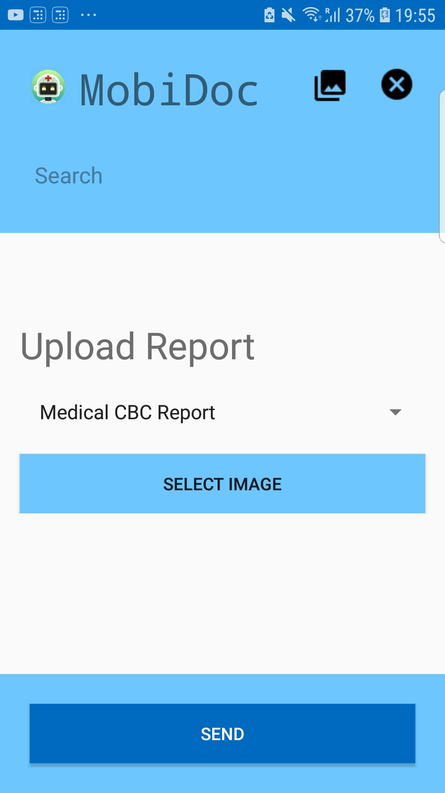

# MobiDoc
Android application which works on multiple neural networks and regression models that takes input from the user as text and images, then predicts the disease using the regression model and neural net. Users can also input medical reports which 
will be analysed by the app using optical character recognition.

## Developers
Justin John Mathew <a href="https://www.linkedin.com/in/justinjmathew">(LinkedIn)</a>  
Alan Henry <a href="https://www.linkedin.com/in/alanrhenry/">(LinkedIn)</a>  
Donald Abraham <a href="https://www.linkedin.com/in/donald-abraham0001/">(LinkedIn)</a>  
Naveen Sreevalsan <a href="https://www.linkedin.com/in/naveensreevalsan/">(LinkedIn)</a>  
Joel Mathew Koshy <a href="https://www.linkedin.com/in/joel-mathew-koshy/">(LinkedIn)</a>  
